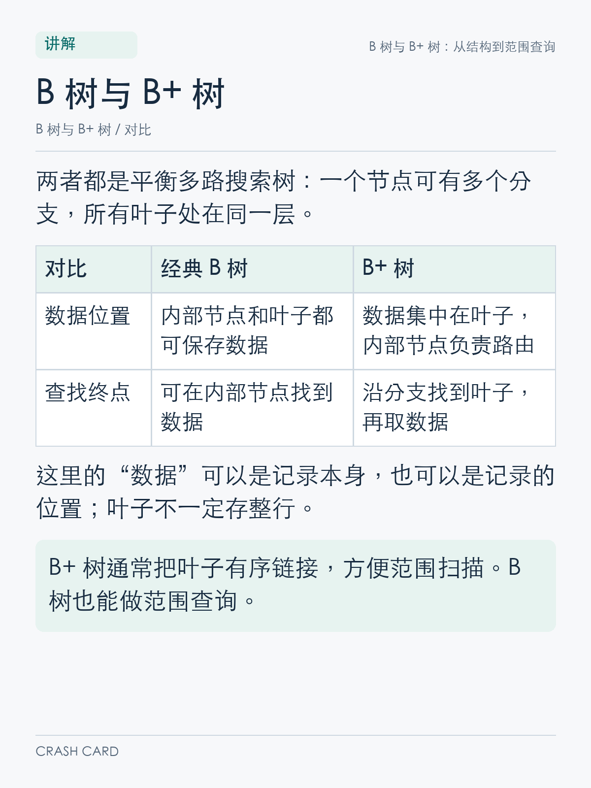
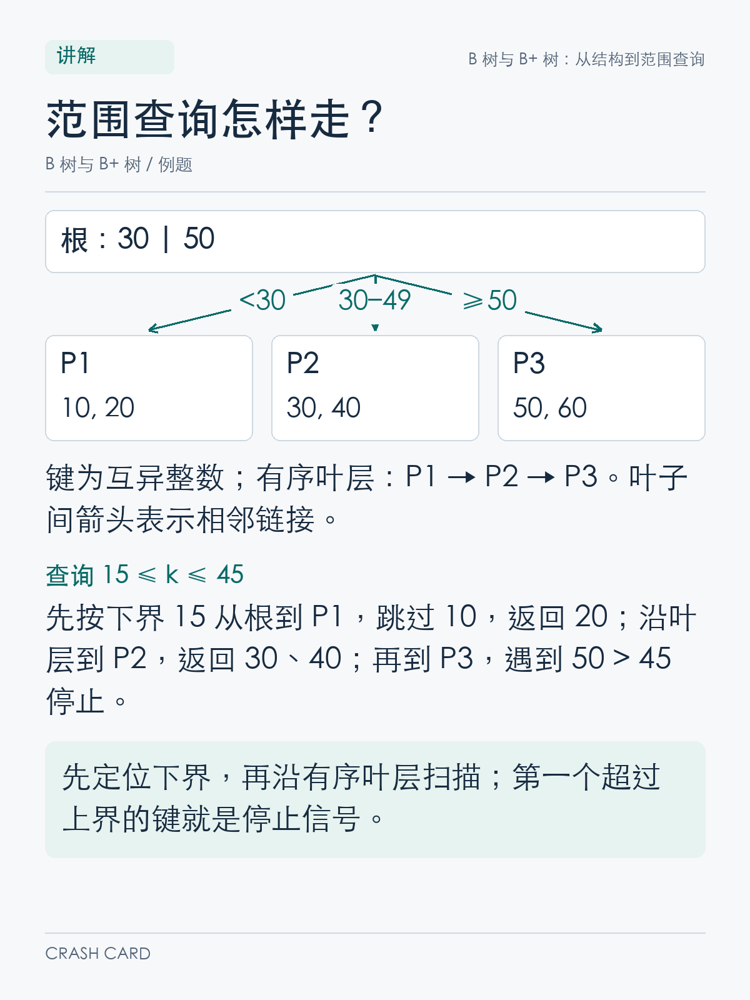
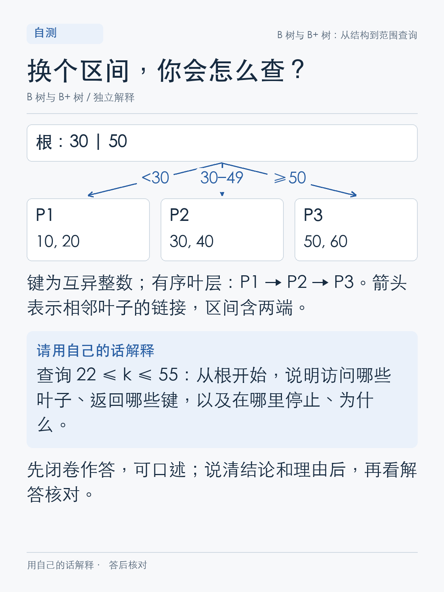
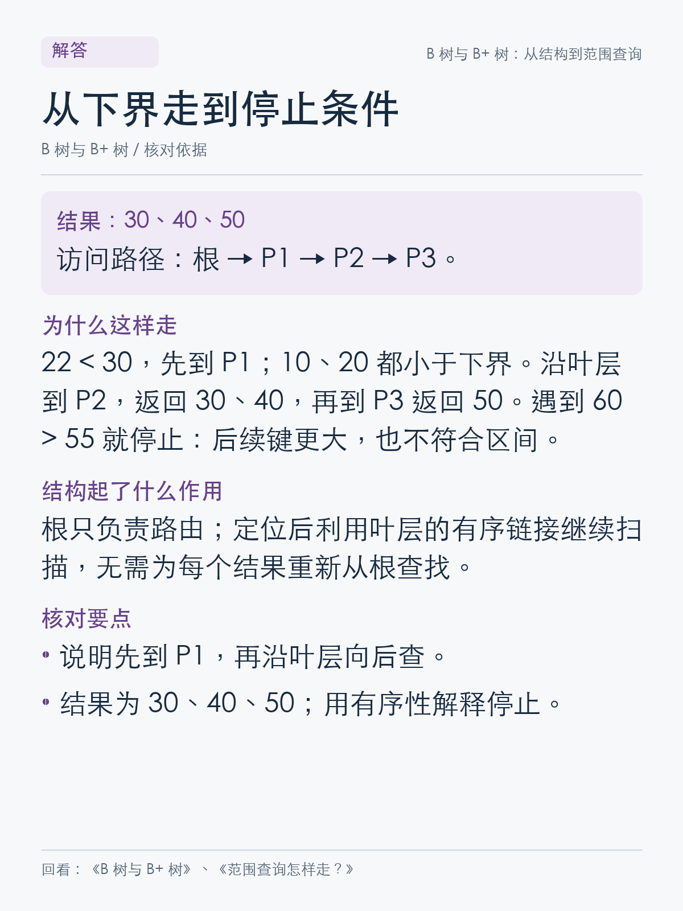

# Crash Card

**把知识讲清楚，再用自己的话检验。**

Crash Card 是一个中文学习 Skill：把知识主题、笔记、文章或口述整理成 **1200 × 1600 的讲解、自查、解答 PNG 卡片**，并围绕「自己解释 → 找到缺口 → 补学 → 再解释」带你复习。适合技术面试准备、概念辨析、公式推导和日常知识复盘。

```text
主题 / 学习材料 → 讲解卡 → 自查卡 → 自己作答 → 解答与语义核对
                              ↑                    ↓
                              └──── 变式复检 ← 按缺口补学
```

[项目亮点](#项目亮点) · [效果演示](#效果演示b-树与-b-树) · [安装](#安装) · [使用方式](#使用方式) · [社交媒体素材](#整理社交媒体素材) · [复现示例](#复现示例)

## 项目亮点

| 亮点 | 你实际得到什么 |
| --- | --- |
| **完整的学习闭环** | 讲解保留前提、原因和例子；自查要求你重建解释；解答附核对点和补学位置。可以继续针对缺口练习。 |
| **按含义核对口述** | 区分正确、部分正确、错误、尚未覆盖和待确认；接受合理改述，检查关系和条件是否成立。 |
| **题目、答案、核对标准同源** | 每题的 `solution` 同时驱动解答 PNG、文字稿和口述核对标准，修改时有明确的统一来源。 |
| **内容决定版式** | 概念、公式、流程、对比、例题、纠错六种主体版式；支持表格、有限分支流程图、代码、数学公式和矩阵，复杂解释可以连续多卡。 |
| **可检查的本地出图** | 使用实际字体测量后排版；遇到缺字或溢出明确报错。输出校验检查图片解码、尺寸、内容块和哈希，并配合逐张视觉检查。 |
| **可保存、可复现、可继续学** | 同时交付 PNG、来源、原始数据和复习入口；每批独立保存。学习状态依据实际作答记录，不把出图完成当作已经掌握。 |

内容整理与反馈由 Agent 按 Skill 执行；Python 脚本负责校验、排版、绘制和导出。**渲染阶段在本地完成**，无需浏览器、在线公式服务或本机 LaTeX；模型交互和资料查证仍取决于你使用的 Agent 与工具。

## 效果演示：B 树与 B+ 树

下面是项目渲染器生成的 **4 张真实卡片**，演示一个小目标：理解两种树的数据位置，并走通 B+ 树的范围查询。图片均可点击查看原图；对应数据与完整导出见 [examples/b-trees](examples/b-trees)。

### 1. 先理解：结构对比 + 具体过程

| B 树与 B+ 树的结构差异 | 在示意树上查询 `15 ≤ k ≤ 45` |
| :---: | :---: |
| [](examples/b-trees/explanation/ex-structure.png) | [](examples/b-trees/explanation/ex-range.png) |

示例限定为经典教材结构、互异整数键和包含两端的区间；叶子间有有序链接。关键知识依据 [OpenDSA 的 B-Trees 教材](https://opendsa-server.cs.vt.edu/ODSA/Books/CS3/html/BTree.html)与 [CMU 15-445/645 课程讲义](https://15445.courses.cs.cmu.edu/fall2024/notes/08-indexes1.pdf)，数值和题目为本项目编写。

### 2. 再自查：换一个区间，自己走一遍

查询改成 `22 ≤ k ≤ 55`。先说明从根到哪些叶子、返回哪些键、在哪里停止以及原因，再展开解答。

<a href="examples/b-trees/self-check/sc-range.png"></a>

<details>
<summary><strong>3. 答完再展开：参考解答与核对标准</strong></summary>

<a href="examples/b-trees/answer/an-range.png"></a>

结果是 **30、40、50**。从根先到 P1，跳过小于 22 的键，再沿叶层到 P2、P3；遇到 60 大于 55 时停止。关键是解释「下界定位 → 叶层扫描 → 利用有序性停止」，只列结果还不足以检查过程是否理解。

</details>

### 4. 按缺口补学，再检验一次

例如下面这段**模拟回答**：

> 「22 不在树里，所以没有结果。」

核对时会指出：这里把范围查询当成了精确匹配。回看 `ex-range`，解释如何找到第一个不小于下界的键，然后换成 `35 ≤ k ≤ 50` 再走一次。

<details>
<summary>变式题参考答案</summary>

从根到 P2，跳过 30，返回 40；沿叶层到 P3，返回 50；遇到 60 超过上界后停止。结果为 **40、50**，注意上界 50 也包含在结果内。

</details>

这是交互流程示意，不是任何学习者的真实评分。看过答案后的复述与独立答对会分别记录；没有实际作答时，状态保持「未检验」。

## 安装

需要能读取本地 Skill、执行 Python 的 Agent。下面以 **Codex** 为例；制作 PNG 还需要 **Python 3.10+** 和覆盖中文的本地字体。

### 方式一：让 Codex 安装

把下面这段发给 Codex：

```text
$skill-installer 请从 https://github.com/owariband/crash-card 安装 crash-card。
Skill 位于仓库根目录，请保留 scripts、references、assets 和 requirements.txt。
```

安装后，在新任务中调用 `$crash-card`。若没有识别到新 Skill，重启 Codex 后再试。首次出图时，可让 Agent 在虚拟环境中按 `requirements.txt` 安装依赖并运行环境预检。

### 方式二：手动安装

macOS / Linux 终端：

```bash
mkdir -p "$HOME/.agents/skills"
git clone https://github.com/owariband/crash-card.git \
  "$HOME/.agents/skills/crash-card"
```

`~/.agents/skills/` 是 Codex 的用户级 Skill 目录；只供某个项目使用时，也可以安装到该项目的 `.agents/skills/crash-card/`。**仓库根目录本身就是 Skill**，安装后应能找到 `crash-card/SKILL.md`。安装目录与调用方式参见 [OpenAI 官方 Skills 文档](https://learn.chatgpt.com/docs/build-skills)。已有同名安装时沿用原位置，避免重复安装。

为 PNG 渲染准备独立环境：

```bash
# python3 必须为 3.10 或更高版本。
SKILL_ROOT="$HOME/.agents/skills/crash-card"
CARD_VENV="$HOME/.venvs/crash-card"
python3 -m venv "$CARD_VENV"
CARD_PYTHON="$CARD_VENV/bin/python"
"$CARD_PYTHON" -m pip install -r "$SKILL_ROOT/requirements.txt"
"$CARD_PYTHON" "$SKILL_ROOT/scripts/check_environment.py"
```

把这个解释器路径告诉 Agent，后续制卡就可以复用。若通过安装器安装，将 `SKILL_ROOT` 换成实际安装目录。预检成功会显示 `v2 environment ready`，并确认中文字符、公式和 PNG 解码可用。

<details>
<summary>Windows PowerShell 对应命令</summary>

```powershell
$SkillRoot = Join-Path $HOME '.agents/skills/crash-card'
New-Item -ItemType Directory -Force (Split-Path $SkillRoot) | Out-Null
git clone https://github.com/owariband/crash-card.git $SkillRoot

# 选择本机已安装的 Python 3.10+。
$CardVenv = Join-Path $HOME '.venvs/crash-card'
py -3 -m venv $CardVenv
$CardPython = Join-Path $CardVenv 'Scripts/python.exe'
& $CardPython -m pip install -r (Join-Path $SkillRoot 'requirements.txt')
& $CardPython (Join-Path $SkillRoot 'scripts/check_environment.py')
```

</details>

缺少中文字体时，可以用 `--font-path` 显式指定 `.ttf`、`.otf` 或 `.ttc` 字体；预检与渲染使用同一字体。详细说明见 [运行环境与字体](references/runtime.md)。当前仓库记录了 macOS 实测；Windows/Linux 使用同一 Python 渲染路径，尚未完成这两个平台的实测验收。

更新手动安装的 Skill：

```bash
git -C "$HOME/.agents/skills/crash-card" pull --ff-only
"$CARD_PYTHON" -m pip install -r "$SKILL_ROOT/requirements.txt"
```

上面的更新命令沿用同一终端中设置的 `SKILL_ROOT` 和 `CARD_PYTHON`。

## 使用方式

### 从主题制作完整卡包

```text
$crash-card 帮我理解 B 树和 B+ 树。
重点讲清楚数据放在哪里，以及 B+ 树怎样做范围查询。
生成讲解、自查和独立解答 PNG，保留必要前提和具体例子。
本次保存到当前工作目录的 cards 文件夹。
```

也可以粘贴笔记、提供 Agent 能读取的文章或文件，让它先核对材料，再按知识单元组织卡片。范围较大时说明学习目标，例如「能在面试中解释原理并走通一个例子」。

### 核对自己的理解

```text
$crash-card 核对我的解释：
“B+ 树的内部节点负责导航，找到起点后沿叶子找后续记录。
不过我不确定，下界这个数不存在时该怎么办。”
指出我讲对的部分和缺口，补讲后给我一道变式题。
```

可以提供文字，也可以使用当前平台支持的语音输入或转写。Skill 依据实际可见的内容核对含义；它本身不负责录音或额外的语音识别。只做口述核对时，无需先生成卡片。

### 用已有卡包快速复习

```text
$crash-card 使用 cards 下已有的 B 树卡包带我复习。
从 self-check 开始，一次给我一道题，先不要展示答案。
我回答后按同题标准核对；有缺口时再定位讲解卡。
```

快速复习顺序：**自查 → 作答 → 解答 → 按缺口回看讲解 → 变式复检**。`manifest.json`、文字稿和核对稿含有明文答案，独立自查时从 `self-check/` 进入。

### 整理社交媒体素材

```text
$crash-card 这套卡片要发社交媒体，请按完整知识点整理发布包。
每期一个文件夹，图片按上传顺序排列；张数和期数由内容决定。
需要练习篇时，将题目与完整答案放在同一期的不同图片中，先题后答。
```

这是可选的发布整理，保留原来的学习闭环。完整机制可以分讲解篇与练习篇，小知识点可以一期完成；不固定“引入、解释、边界”各占一张，也不强制封面。每张卡仍应完成有实质内容的子问题，必要条件和推理不因分期而删减。

母版沿用原批次目录，只新增 `posts/`。下面的期数、文件名与张数仅为示意：

```text
批次目录/
├── manifest.json、三类 PNG 与原有配套文件
└── posts/
    └── 01-具体主题/
        ├── 01-实际卡片标题.png
        ├── …                     # 张数由内容决定
        └── post.md                # 需要配文时提供
```

同一期图片直接平铺，文件名控制上传顺序；配文、发布映射和压缩包按需求提供。母版是统一内容来源，修改后重新导出。Python 渲染器生成母版，Agent 按[社交发布规则](references/social-publishing.md)整理发布包；生成本地素材不会自动发布到平台。

**卡面标记**：左上为“讲解 / 自测 / 解答”，右上使用简短卡包名称；内部 ID 只用于文件和引用。解答用讲解标题提示补学，过长时提示回看本主题讲解篇。单张右下留空，多张连续内容显示 `1/2` 等页次，不绘制像素尺寸；连续内容页次与整期上传序号彼此独立。

### 保存位置

首次制卡且没有指定位置时，Agent 会询问默认根目录，并将偏好保存在 `~/.config/crash-card/config.json`。以后每批新建 `YYYY-MM-DD_HHMMSS_主题/` 子目录。提示词中的「本次保存到……」优先于默认位置，且不改变长期偏好。卡包应放在 Skill 安装目录之外。详见 [保存规则](references/output-storage.md)。

## 每个卡包包含什么

```text
YYYY-MM-DD_HHMMSS_主题/
├── explanation/       # 知识讲解 PNG
├── self-check/        # 自查问题 PNG
├── answer/            # 独立解答 PNG
├── manifest.json      # 知识单元、来源、题目、solution 与卡片定义
├── transcript.md      # 同源完整文字稿
├── answer-key.md      # 参考解答与核对标准
├── oral-rubric.json    # 供 Agent 核对口述的结构化标准
├── review.md          # 复习入口与题答、补学映射
├── sources.md         # 来源与适用说明
└── render-report.json # 实际绘制的内容块、尺寸和哈希
```

实际发生作答核对时，Agent 可另存 `learning-log.md`，记录回答、缺口、提示情况与后续任务。通用卡包与个人学习记录分开保存。

## 复现示例

仓库中的 [B 树示例 manifest](examples/b-trees/manifest.json) 已配齐讲解、自查和解答。完成上面的依赖安装后，可以在任意工作目录重新生成它：

```bash
SKILL_ROOT="$HOME/.agents/skills/crash-card"
CARD_PYTHON="$HOME/.venvs/crash-card/bin/python"
# 创建独立临时目录，不覆盖已有卡包，也不修改默认保存偏好。
OUTPUT_DIR="$(mktemp -d "${TMPDIR:-/tmp}/crash-card-demo.XXXXXX")"

"$CARD_PYTHON" "$SKILL_ROOT/scripts/check_environment.py"
"$CARD_PYTHON" "$SKILL_ROOT/scripts/validate_manifest.py" \
  "$SKILL_ROOT/examples/b-trees/manifest.json"
"$CARD_PYTHON" "$SKILL_ROOT/scripts/render_cards.py" \
  "$SKILL_ROOT/examples/b-trees/manifest.json" --output-dir "$OUTPUT_DIR"
"$CARD_PYTHON" "$SKILL_ROOT/scripts/validate_outputs.py" \
  "$OUTPUT_DIR" --manifest "$OUTPUT_DIR/manifest.json"
```

如果你是在开发目录中克隆本仓库，将 `SKILL_ROOT` 改为仓库绝对路径。以上命令生成 **4 张 1200 × 1600 PNG** 和全部配套文件；字体不同可能带来排版或像素差异。修改内容后应重新渲染、校验并查看实际图片。

自定义卡片从 [manifest 格式](references/card-schema.md)与 [设计规则](references/design.md)开始。环境预检和输出校验不会替代事实核验；公式使用 mathtext 子集，流程图支持有限分支的无环图。旧版 manifest 的兼容与迁移见 [运行说明](references/runtime.md)。

## 项目结构

| 位置 | 内容 |
| --- | --- |
| [SKILL.md](SKILL.md) | Agent 的学习工作流与交付标准 |
| [agents/openai.yaml](agents/openai.yaml) | Codex 展示名称与默认提示词 |
| [references/](references/) | 设计、schema、运行、存储和学习反馈说明 |
| [scripts/](scripts/) | 环境预检、manifest 校验、PNG 渲染、导出与迁移 |
| [assets/theme.json](assets/theme.json) | v2 画布、配色、字号和间距 |
| [examples/b-trees/](examples/b-trees/) | 本 README 的完整可复现示例 |
| [tests/](tests/) | 数据契约、输出完整性与布局检查 |
